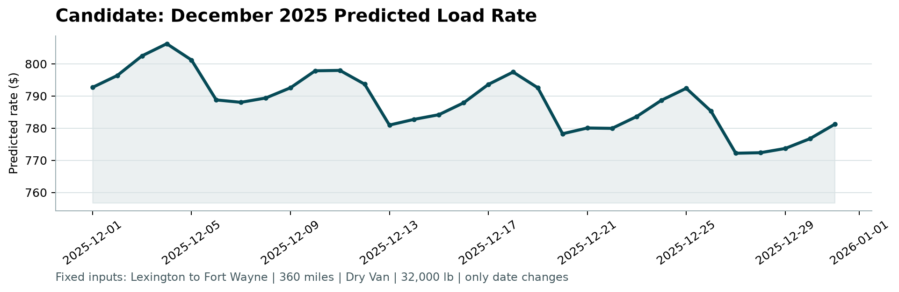

# Freight rate prediction

Joe | Machine Learning Engineer assessment | 4 October 2026

## Result and approach

The selected CatBoost model predicts the total posted price of a freight load from its route, equipment, weight, date, and market information. On the September-October holdout, it achieved **$125.86 mean absolute error (MAE)**, compared with **$140.54** for an equipment-and-distance baseline: a **10.4% reduction**. RMSE remained almost unchanged at $639.05. Large errors are still a material weakness.

I used earlier months to predict later months because the submission requires forecasts for November and December. After model selection and local evaluation, the selected models were fitted on all 48,000 labeled loads. The submission contains 12,000 predictions matched by load ID and a separate 31-day December scenario. Their true future accuracy is unknown because the final labels are unavailable.

## Data quality

The development data spans January 1 to October 31, 2025; the final inputs span November 1 to December 31. The audit found no duplicate load IDs, duplicate loads excluding IDs, or IDs shared between the two files.

| Finding | Development | Final inputs | Handling |
| --- | ---: | ---: | --- |
| Missing weights | 300 | 165 | Preserve as missing; add a flag |
| Nonpositive weights | 292 | 145 | Convert to missing; do not take absolute values |
| Missing market indices | 374 | 249 | Preserve as missing; add a flag |
| Unfamiliar cities | - | 8 | Allow new categories; inspect a city stress test |

There are also 1,461 final loads on lanes absent from development data. Coordinates were internally consistent by training city and were used as supplied. No external geocoding was added. The audit flags 646 development rows with rates below $1 or above $5 per mile; those thresholds are diagnostic, not deletion rules. All target values remain in training and evaluation.

## Validation design

The table uses inclusive calendar months. In code, each evaluation end date is exclusive, so rows cannot cross a split boundary.

| Purpose | Training period | Evaluation period | Train rows | Evaluation rows |
| --- | --- | --- | ---: | ---: |
| Selection window 1 | Jan-Apr 2025 | May-Jun 2025 | 19,110 | 9,696 |
| Selection window 2 | Jan-Jun 2025 | Jul-Aug 2025 | 28,806 | 9,671 |
| Final local holdout | Jan-Aug 2025 | Sep-Oct 2025 | 38,477 | 9,523 |
| Submission fit | Jan-Oct 2025 | Nov-Dec 2025 | 48,000 | 12,000 unlabeled |

Models were selected using the equally weighted mean of dollar MAE over the two selection windows. September-October results were inspected only after that choice was frozen. Fitted preprocessing and city coordinate lookups use training rows only. Load IDs and posted rates never enter the feature matrix. Final input labels are not available for tuning.

<!-- pagebreak -->

## Model choice

The baseline estimates median rate per mile within equipment and distance bands, with an overall median fallback. CatBoost adds interactions between numeric and categorical inputs, such as equipment, route, and distance, while handling missing numeric values and unfamiliar categories.

The CatBoost configuration is fixed: **700 trees, depth 6, learning rate 0.05, L2 leaf regularization 5, and seed 42**, using four CPU threads. There was no large hyperparameter search and no early stopping against the final holdout.

### Features and objective

Features include pickup and delivery cities, the directed lane, equipment, distance and its log and inverse, weight, weight per mile, coordinates and their differences, weekday, weekend, and annual sine/cosine terms. Missing-value flags identify unavailable weight and market information. These transformations are computed consistently during fitting and prediction.

The target is rate per mile. Each row receives a weight equal to its distance, and the prediction is multiplied by distance to return total dollars. This aligns the training loss with the evaluation criterion:

**distance x |predicted rate per mile - actual rate per mile| = absolute total-dollar error.**

MAE was chosen to limit the training influence of extreme rates. RMSE, WAPE, and R-squared are also reported to show behavior that MAE alone can hide. No targets were clipped or removed to improve the reported scores.

### Comparing available inputs

| Candidate | May-Jun MAE | Jul-Aug MAE | Mean MAE |
| --- | ---: | ---: | ---: |
| Equipment/distance baseline | $197.93 | $141.47 | $169.70 |
| CatBoost core inputs | $134.41 | $142.22 | $138.31 |
| CatBoost including quote signal | $135.10 | $118.17 | $126.63 |
| CatBoost excluding quote signal | $119.30 | $111.45 | $115.38 |

The selected main model excludes `quote_signal` and keeps `market_index`. The quote signal's correlation with rate per mile switches sign across months and is close to zero in August. Its origin and timing are unspecified. Removing it improved average forward-validation MAE; that is the basis for excluding it, rather than assuming every supplied field must help.

The December file omits market indices, quote signals, and coordinates. A separate **core model** uses the six supplied load fields and looks up coordinates from its training data. It ignores supplied coordinates even during validation, matching the information available for that scenario. Core had lower mean selection-window MAE than the baseline and was chosen for December.

### Follow-up linear comparison

A Ridge regression benchmark was added after the original holdout had been inspected. It uses the same no-quote features, with training-only median imputation, standardization, and one-hot encoding. With fixed alpha 10, its MAE was **$118.82** in May-June and **$180.05** in July-August, averaging **$149.44**. It was competitive in the first window but less consistent across time.

Ridge uses normalized distance-squared weights, aligning its data-fit term with squared total-dollar error, plus an L2 penalty. Its loss differs from CatBoost's MAE loss. This is a limited follow-up comparison, not a new blind holdout result or proof that every linear model is inferior. It did not change the frozen selections or submission predictions.

<!-- pagebreak -->

## Holdout results and failure modes

The following results use all **9,523 September-October loads**, with models trained on the preceding 38,477 loads. All rates, including extreme values, are retained. The core model is evaluated on these same loads with its restricted inputs; its score is not a measurement of December accuracy.

| Model | MAE | RMSE | WAPE | R-squared | Median error |
| --- | ---: | ---: | ---: | ---: | ---: |
| Baseline | $140.54 | $638.82 | 5.87% | 0.8248 | $62.83 |
| Selected main model | $125.86 | $639.05 | 5.26% | 0.8246 | $50.86 |
| Selected core model | $125.20 | $638.68 | 5.23% | 0.8248 | $51.29 |

MAE is the average absolute dollar error. RMSE penalizes large errors more heavily. WAPE is total absolute error divided by total actual posted rates. Median error is median absolute error; it describes a typical load but is not a substitute for MAE.

The main model reduces MAE by $14.67 per load, or 10.4%, compared with the baseline. Its median error also falls, but RMSE is effectively unchanged. The largest 96 absolute errors, about 1% of the holdout, account for **96.5% of squared error**. This explains why lower typical error does not imply that costly failures have been solved.

Mean signed error is **-$99.10** for the main model, versus -$43.11 for the baseline. The main model therefore has a stronger average tendency to underpredict, despite its better MAE. No adjustment was fitted to holdout residuals. A pricing application would need a business decision about the cost of underquoting before choosing a different loss or calibration strategy.

### Where errors increase

| Main-model slice | Loads | MAE | Mean signed error |
| --- | ---: | ---: | ---: |
| September | 4,670 | $117.99 | -$92.45 |
| October | 4,853 | $133.44 | -$105.49 |
| Distance below 250 miles | 550 | $23.63 | -$17.16 |
| Distance at least 2,000 miles | 1,534 | $228.75 | -$180.26 |

Absolute dollar errors are larger on long trips. These slices identify useful monitoring groups; they were not used to retune the frozen model. The core model's MAE is $0.66 lower than the main model on this holdout. The main choice remains unchanged because selection was based on the earlier windows.

### Unfamiliar cities

The temporal holdout contains no new cities and only 21 unseen-lane loads, which is too little evidence about unfamiliar routes. A separate diagnostic removes all training loads involving six cities chosen by a fixed alphabetical rule, then predicts their July-August loads.

The resulting training set has 23,800 loads and the evaluation set has 1,671. MAE is **$109.19** for the main model, **$128.58** for the baseline, and **$143.69** for the core model. This test supports the main model under one city-exclusion design, while highlighting weaker performance from the restricted core inputs. It does not establish accuracy on the eight actual new cities in the final data.

<!-- pagebreak -->

## Fixed December prediction chart

The supplied scenario holds the route and load details constant: **Lexington to Fort Wayne, 360 miles, Dry Van, 32,000 lb**. Only the date changes, from December 1 to 31, 2025. The figure below is the original chart generated by the supplied `score.py` from `december_predictions.csv`.



*Figure 1. Predicted total posted rate for the fixed December scenario. The displayed vertical axis is truncated; the chart does not show an uncertainty interval.*

Predictions range from **$772.20 to $806.28**, with a mean of **$788.11**. The weekly changes and gradual decline reflect the model's date features under fixed load inputs. They are not evidence of observed December market behavior. Training contains no previous December, so December seasonality and holiday surcharges cannot be validated. No future market indices or unrelated quote signals were invented to fill the missing fields.

## Reproducing the submission

Use Python 3.12, create a virtual environment, then run these commands from the repository root with that environment's Python:

```text
python -m pip install -r requirements-lock.txt
python run.py
```

The pipeline reproduces the tests, audit, experiments, final training, predictions, and scorer chart. The README gives platform-specific setup commands. Model binaries are regenerated locally and excluded from Git.

The submitted validation file has exactly `load_id,predicted_rate`, with 12,000 unique IDs in template order and positive finite predictions. The December file preserves its six supplied input columns and adds predictions for all 31 rows. The scorer accepts both files and generates Figure 1. It validates format, not accuracy against Spotter's hidden labels. All 23 tests and the GitHub dependency and prediction-file checks passed.

## Limits and next checks

The final inputs have higher missing-field rates and unfamiliar routes. Before production use, I would confirm market-index availability at quote time, review extreme-rate records with a domain expert, and evaluate the cost of underprediction. Once new labels arrive, monthly MAE, bias, and errors by distance, equipment, and unfamiliar city should be monitored. This is a batch pipeline; an online service and production monitoring have not been implemented.

### Repository and supporting evidence

[github.com/joeElieSarkis/spotter-freight-rate-prediction](https://github.com/joeElieSarkis/spotter-freight-rate-prediction)

Results correspond to code commit `60823f6`. Audit, selection, holdout, slice, city-stress, and Ridge results are saved in `artifacts/`. Its `training_manifest.json` records versions, data hashes, dates, and model parameters. The supplied inputs and original assessment instructions remain in the repository.
